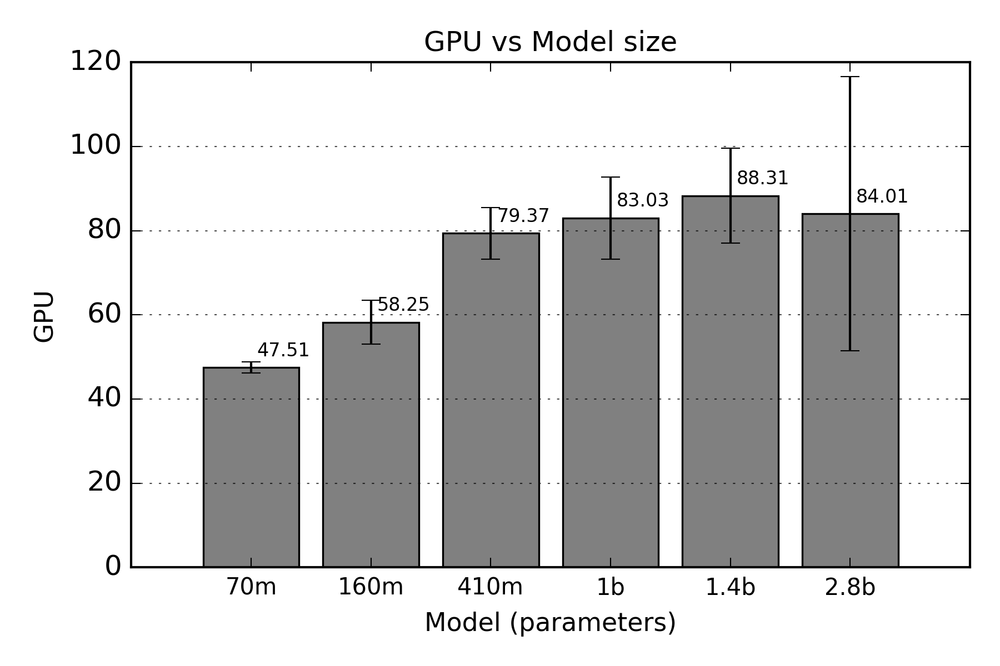

# Jetson Inference Resource Benchmark

This repository contains a benchmark designed to analyze resource usage on NVIDIA Jetson devices during inference.  

> ⚠️ **Note:** This benchmark has only been tested on the **Jetson Orin Nano 8GB**.

## Setup Instructions

1. **Follow the Jetson PyTorch installation guide**:  
   Make sure your Jetson device is correctly set up by following the instructions in this blog:  
   [https://ninjalabo.ai/blogs/jetson_pytorch.html](https://ninjalabo.ai/blogs/jetson_pytorch.html)

2. **Create a Python virtual environment** (optional but recommended):  

   ```bash
   python3 -m venv venv
   source venv/bin/activate
   ```
   
3. **Install dependencies:**

   ```bash
    pip install --upgrade pip
    pip install -r requirements.txt
   ```
> ⚠️ This requirements.txt should install the correct PyTorch version from NVIDIAs repository in your new venv. If not, follow the above blog to manually install it.


## Usage Example

Once the environment is ready, you can run the benchmark to analyze resource usage during inference. Example:

   ```bash
    # Activate the virtual environment if not already active
    source venv/bin/activate

    # Run the benchmark script
    python main.py
   ```

The benchmark will provide metrics such as:

    GPU usage

    Memory consumption

    Inference time per batch

You can adjust the input data or model list in the config.py file.


## Resuls

Bar charts from preliminary experiments:

| Execution Time | GPU Usage | RAM Usage |
|----------------|-----------|-----------|
|  |  |  |

> ⚠️ **Note:** Larger models are not included in the benchmark because they exceed the memory of the Jetson Orin Nano 8GB and may cause it to crash. If you want to test them anyway, they are commented out in `config.py`.


